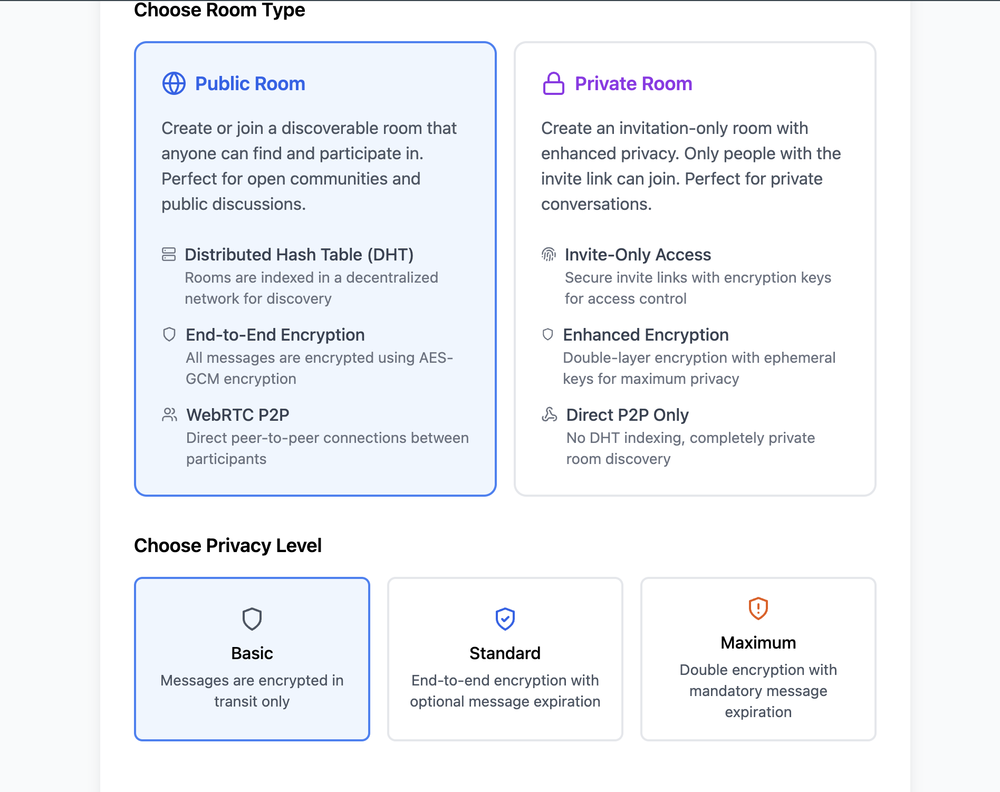
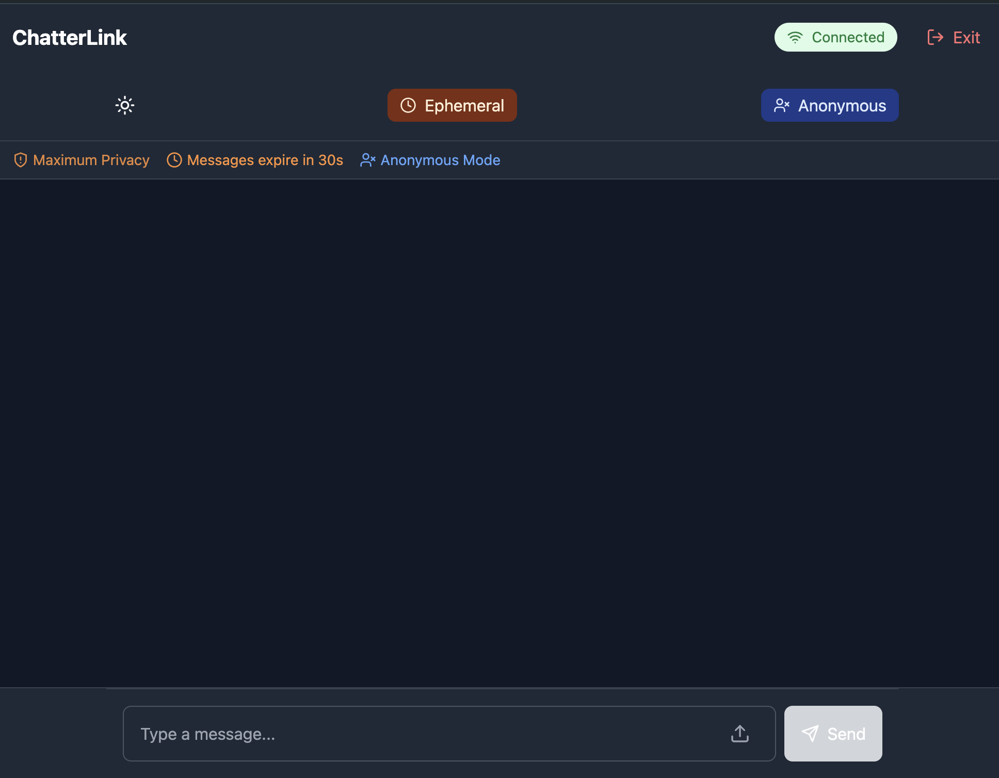
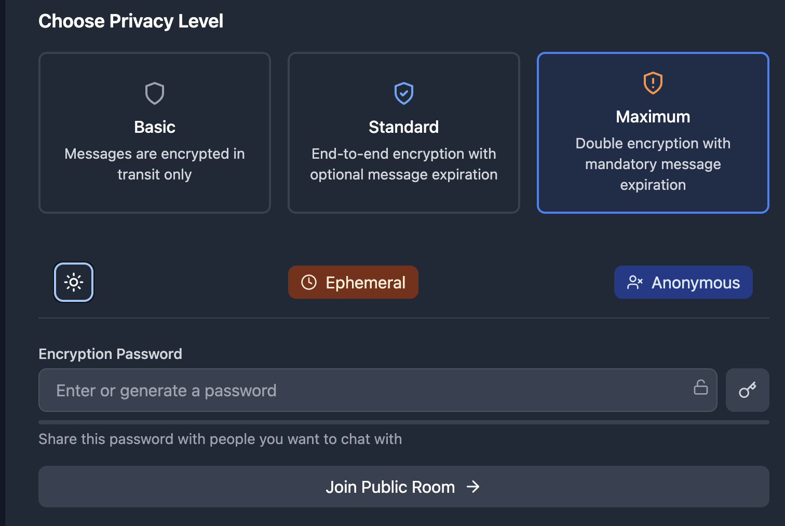

# Secure P2P Chat Application


A privacy-focused, peer-to-peer chat application built with modern web technologies and advanced cryptographic features. Designed to ensure secure and anonymous communication between users without relying on centralized servers.

## Table of Contents
- [Introduction](#introduction)
- [Features](#features)
- [Technical Stack & Skills](#technical-stack--skills)
- [Architecture](#architecture)
- [Installation](#installation)
- [Usage](#usage)
- [Screenshots](#screenshots)
- [Contributing](#contributing)
- [License](#license)

## Introduction

In an era where digital privacy is paramount, the Secure P2P Chat Application offers a robust solution for secure and private communication. Leveraging cutting-edge technologies, this application ensures that your conversations remain confidential and free from third-party surveillance.

## Features

- **End-to-End Encryption:** All messages are encrypted using AES-GCM and Kyber post-quantum cryptography.
- **Post-Quantum Security:** Utilizes Kyber-Crystals for quantum-resistant encryption.
- **Multiple Privacy Levels:** Choose between Basic, Standard, and Maximum privacy settings.
- **Secure File Sharing:** Encrypted file transfers with support for large files via chunking.
- **Ephemeral Messaging:** Set messages to auto-delete after a specified time.
- **Anonymous Mode:** Engage in conversations without revealing your identity.
- **Room Management:** Create public or private rooms with customizable settings.
- **Decentralized Networking:** Uses WebRTC and DHT for peer discovery without central servers.
- **IPFS Integration:** Store and retrieve files from a decentralized IPFS network.
- **Responsive Design:** Seamless experience across desktop and mobile devices.
- **Dark/Light Themes:** Customize the UI according to your preference.

## Technical Stack & Skills

### Frontend Technologies
- **React 18** with TypeScript
- **Vite** for fast development and building
- **Tailwind CSS** for responsive styling
- **Lucide React** for modern icons
- **PeerJS** for WebRTC peer-to-peer connections

### Security & Encryption
- **End-to-End Encryption** using Web Crypto API
- **Post-Quantum Cryptography** using Kyber-Crystals
- **Multiple Privacy Levels**
  - Basic: Standard WebRTC encryption
  - Standard: AES-GCM encryption
  - Maximum: Quantum-safe encryption with Kyber
- **Secure File Sharing** with encryption
- **Message Signatures** for authenticity verification
- **Ephemeral Messages** with auto-deletion
- **Anonymous Mode** for enhanced privacy

### Networking & P2P Features
- **WebRTC** for peer-to-peer communication
- **Distributed Hash Table (DHT)** for room discovery
- **IPFS Integration** for decentralized file storage
- **Direct P2P Connections** for private rooms
- **Room Management**
  - Public and private rooms
  - Room metadata encryption
  - Invite link system
  - Room expiration

### Advanced Features
- **Quantum-Safe Encryption Service**
  - Kyber key encapsulation
  - Hybrid encryption system
  - Post-quantum secure key exchange
- **File Handling**
  - Chunked file transfers
  - Progress tracking
  - File preview system
  - Automatic file expiration
- **Security Indicators**
  - Encryption status
  - Message verification
  - Privacy level indicators

### State Management & Data Handling
- **React Hooks** for state management
  - useState
  - useEffect
  - useRef
  - Custom hooks (useAutoLock)
- **Local Storage** for preferences
- **Service Pattern** for business logic
- **Singleton Pattern** for service instances

### Performance Optimizations
- **Chunked File Transfers**
- **Lazy Loading** for components
- **Efficient Re-rendering** with React
- **Memory Management** with cleanup functions

### UI/UX Features
- **Dark/Light Theme**
- **Responsive Design**
- **Loading States**
- **Progress Indicators**
- **Error Handling**
- **Toast Notifications**

### Development Tools & Practices
- **TypeScript** for type safety
- **ESLint** for code quality
- **Modern JavaScript** features
- **Component-Based Architecture**
- **Service-Oriented Design**
- **Clean Code Principles**

### Security Features
- **Auto-Lock System**
- **Message Expiration**
- **Secure File Handling**
- **Privacy Controls**
- **Input Validation**
- **XSS Prevention**

### Additional Technologies
- **Web Crypto API**
- **TextEncoder/Decoder**
- **Blob Handling**
- **ArrayBuffer Management**
- **URL Management**
- **WebRTC Data Channels**

### Utilities & Libraries
- **PeerJS** for simplified WebRTC connections
- **Kyber-Crystals** for post-quantum cryptography
- **IPFS HTTP Client** for interacting with IPFS nodes
- **Lucide React** for scalable vector icons
- **Tailwind CSS** for utility-first styling

### Development Practices
- **Type-Safe Development**
- **Component Composition**
- **Error Boundary Implementation**
- **Performance Optimization**
- **Security-First Approach**
- **Responsive Design Patterns**
- **Version Control with Git**
- **Continuous Integration (CI)**
- **Automated Testing**

## Architecture

- **Component-Based Structure:** Modular and reusable UI components.
- **Service Layer Pattern:** Separation of business logic into dedicated services.
- **Event-Driven Communication:** Utilizing events for inter-component communication.
- **Modular Design:** Independent modules for scalability and maintainability.
- **Singleton Services:** Ensuring single instances for critical services.
- **Clean Architecture Principles:** Emphasizing separation of concerns and testability.

## Installation

### Prerequisites

- **Node.js** (v14 or higher)
- **npm** or **Yarn**

### Steps

1. **Clone the Repository**
    ```bash
    git clone https://github.com/yourusername/yourrepo.git
    cd yourrepo
    ```

2. **Install Dependencies**
    ```bash
    npm install
    # or
    yarn install
    ```

3. **Configure Environment Variables**
    
    Create a `.env` file in the root directory and add the following:
    ```env
    VITE_INFURA_PROJECT_ID=your_infura_project_id
    VITE_INFURA_API_SECRET=your_infura_api_secret
    ```

4. **Run the Application**
    ```bash
    npm run dev
    # or
    yarn dev
    ```
    
    Open [http://localhost:3000](http://localhost:3000) to view it in the browser.

## Usage

1. **Welcome Screen**
    - Enter your nickname or choose to join anonymously.
    - Select your privacy level and set a password if required.
    - Choose between creating a public or private room.

2. **Chat Interface**
    - Send and receive encrypted messages in real-time.
    - Share files securely with encryption.
    - View message encryption status and privacy indicators.

3. **Room Management**
    - Discover public rooms through the DHT network.
    - Create private rooms with invite links.
    - Manage room settings and participants.

4. **Settings**
    - Toggle between dark and light themes.
    - Set message lifetime for ephemeral messages.
    - Enable or disable anonymous mode.

## Screenshots

### 1. Welcome Screen


*The welcome screen allows users to enter their nickname, choose privacy levels, and decide whether to join anonymously.*

### 2. Chat Interface


*The main chat interface where users can send and receive messages, share files, and view security indicators.*

### 3. Settings Panel


*The settings panel for customizing themes, message lifetimes, and privacy options.*

## Contributing

Contributions are welcome! Please follow these steps to contribute:

1. **Fork the Repository**

2. **Create a Feature Branch**
    ```bash
    git checkout -b feature/YourFeature
    ```

3. **Commit Your Changes**
    ```bash
    git commit -m "Add your descriptive message"
    ```

4. **Push to the Branch**
    ```bash
    git push origin feature/YourFeature
    ```

5. **Open a Pull Request**

Please ensure your code adheres to the project's coding standards and passes all tests.

## License

This project is licensed under the [MIT License](LICENSE). See the [LICENSE](LICENSE) file for details.


